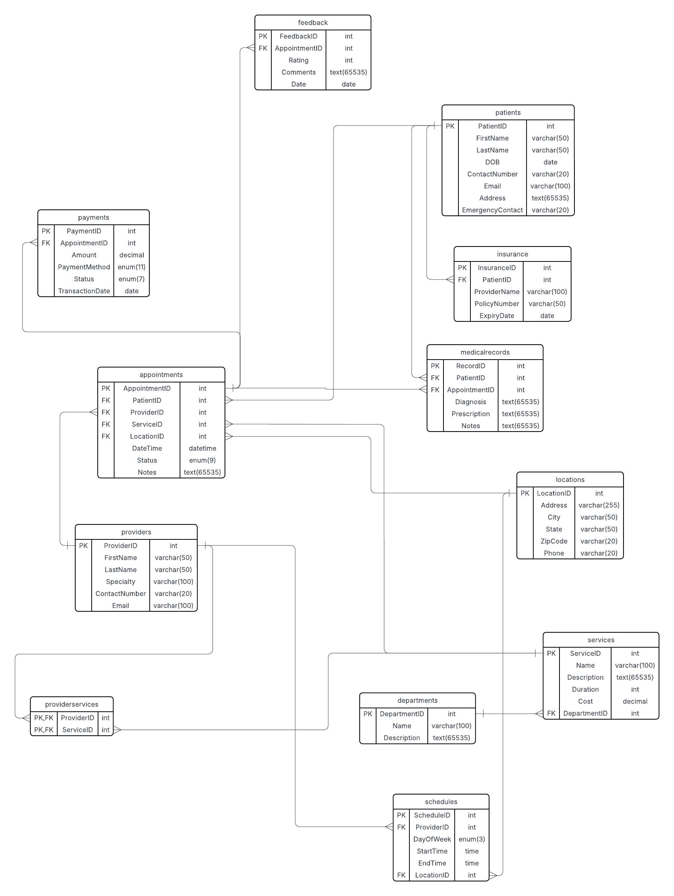

# Clinical-booking-system
Building a database for the clinical booking system that will help store data within the health industry

## ERD


A MySQL database designed to manage appointments, patients, healthcare providers, and related operations for a clinical booking system.

## Features
- Patient management with demographics and insurance tracking
- Provider scheduling with availability constraints
- Appointment booking with status tracking
- Medical records linked to appointments
- Payment processing and feedback system
- ERD-designed relationships with proper normalization

## Database Schema
**Key Tables:**
- `Patients` - Stores patient information
- `Providers` - Manages healthcare professionals
- `Appointments` - Core booking system
- `MedicalRecords` - Health history tracking
- `Payments` - Financial transactions

## Setup Instructions

### Prerequisites
- MySQL Server (8.0+ recommended)
- MySQL Workbench or equivalent client

### Installation
1. **Clone Repository**
   ```bash
   git clone https://github.com/WellBrian/clinical-booking-db.git
   cd Clinical-booking-db 
   ```

    ### Import Database

    - Using MySQL Workbench:

       - Open clinical_booking_system_db.sql

       - Execute all statements (⌘+Shift+Enter / Ctrl+Shift+Enter)

    - Command Line:
    ```bash
    mysql -u root -p < clinical_booking_system_db.sql
    ```
## License
    GPL-3.0 license
